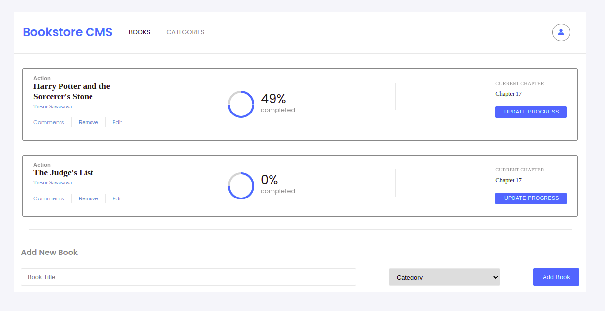

# Bookstore

This project was bootstrapped with [Create React App](https://github.com/facebook/create-react-app).

## Description

> "Bookstore" is a simple website built with `REACT` and `REDUX` that displays a list of books from an API and allows you to add and remove books in the API store.

## Built With

This project is built with:

- 
- 
- 
- 
- 

## Live Demo

Click [here](https://tresorsawasawa.github.io/Bookstore/) to see the live demo

## Getting Started

To get the content of this project locally you need to run this command in your terminal:

1- `git clone hhttps://github.com/tresorsawasawa/Bookstore.git`
2- `cd Bookstore`
3- `npm install` 
  > This will download all the dependancies of the project.
4- `npm start` 
  > The page will open at http://localhost:3000 in your browser.

### Builds the app for production

`npm run build`

It correctly bundles React in production mode and optimizes the build for the best performance. 

## Test

For tracking linter errors locally you need to follow these steps:

- After cloning the project make sure you have run this command

  > `npm install` command

- For tracking the linter errors in HTML file run:

  > `npx hint .`

- For tracking the linter errors in CSS file run:

  > `npx stylelint "\*_/_.{css,scss}"`

- And For tracking the linter errors in JavaScript file run:

  > `npx eslint .`

## Author

👤 **Tresor Sawasawa**

- GitHub: [@tresorsawasawa](https://github.com/tresorsawasawa)
- Twitter: [@tresorsawasawa](https://twitter.com/TresorSawasawa)
- LinkedIn: [Trésor Sawasawa](https://www.linkedin.com/in/tresor-sawasawa/)

## :handshake: Contributing

Feel free to check the [issues page](https://github.com/tresorsawasawa/Bookstore/issues)

## Show your support

Give a :star: if you like this project!

## Acknowledgments

- Thanks to everyone who will get time to check this code especially to code reviewers.
- Thanks [Zeplin](https://app.zeplin.io/project/5b35a9e13227086040f8eb75/screen/5b695e29bb8c844f118f9378) for the template design.

## 📝 License

This project is [MIT](./MIT.md) licensed.
